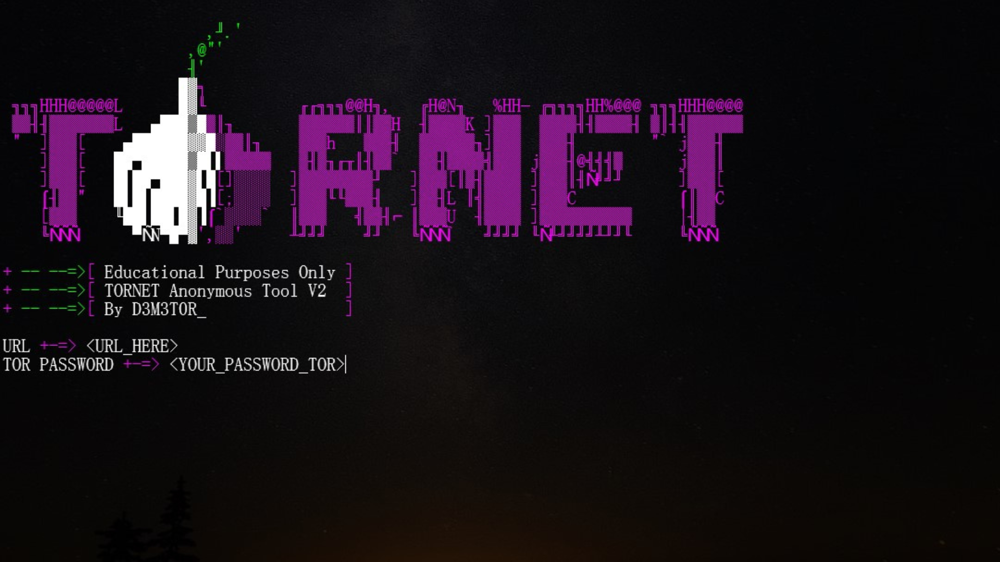
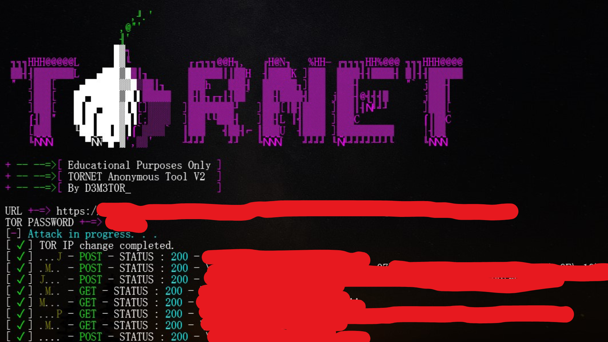

<div align="center">
  <h2 align="center">TORNET </h2>

  <p align="center">
    DDoS Tool (<b> by D3M3T0R </b>)
    <br />
    <br />
    <a href="https://github.com/RetrO-M/TorNet/issues">⚠️ Report Bug</a>
  </p>
</div>

## ❗ Disclaimer

- Educational Purposes Only 
  - don't attack websites you don't have permission to avoid it being illegal, create your own website and do whatever you want in, We are not responsible for your stupidities.
  - This script has been developed with a strictly legitimate purpose to assist law enforcement and cybersecurity professionals in testing the resilience and robustness of computer systems. It is a load testing tool designed to assess a server's or network infrastructure's ability to withstand large amounts of data traffic.

  - This tool is not intended to be used for malicious attacks, such as DDoS attacks, or any other form of cyberattacks that would violate the law. Its usage is exclusively reserved for authorized testing by system owners, with the explicit consent of competent authorities.

  - IMPORTANT: This project is intended solely for legitimate purposes and must only be used with proper authorization. Any use contrary to these guidelines is strictly prohibited. As the creator of this tool, I accept no responsibility for any misuse of the script outside of the legal and ethical parameters outlined here.

  - Violating cybersecurity laws can result in severe criminal penalties, including hefty fines and imprisonment.

  - The use of this tool must always be preceded by an assessment of potential impacts and a thorough planning process to avoid any unintended disruption of essential services. 


## ScreenShot
| Main ScreenShot | Information	|
| ------------  | ------------ |
||


## ⚙️ Installation
* linux-py: `sudo apt install python3`
* win-py: `https://www.python.org/downloads/`
* Start-win: `python main.py`
* Start-Linux: `python3 main.py`

```shell
root~# sudo apt update
root~# sudo apt install tor
root~# tor --version
root~# tor --hash-password < your_password >
root~# sudo nano /etc/tor/torrc   
# Scroll down and search for "HashedControlPassword" and "ControlPort 9051" and remove the "#"
ControlPort 9051
HashedControlPassword < YOU_PASSWORD_HASH >
CookieAuthentication 0
root~# sudo systemctl restart tor
```

```sh
git clone https://github.com/RetrO-M/TorNet
cd TorNet

Install Python modules 
 - pip3 install -r requirements.txt

Start the program
 - python3 main.py
```

## Anonymity

- Without VPN or TOR
  - Without VPN or TOR there will be `70-80%` anonymity
- If you use TOR PROXY, but you don't have a VPN
  - It will be `90-95%` anonymity
- If you have a VPN + TOR PROXY
  - It will be `95-99%` anonymity 

- The headers make tracing difficult but if you use a VPN + TOR it will be complex!

---------------------------------------

<p align="center">
  
  
</p>
